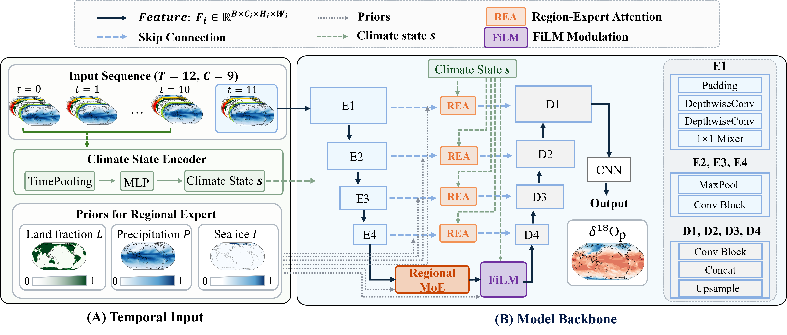

# ISO-UNet
This repository is the official implementation of ISO-UNet: A Climate-State Conditioned Regional Expert Network for Water Isotope Field Regression submitted to ICDM-2026


<p align="center">
  
</p>

## Overview

- **`iso_unet/`** — Python package with ISO-UNet and 14 baselines.
- **`iso_all_dataset/2d_data_clean/`** — training / evaluation pipeline (PyTorch Lightning), per-model YAML configs, and plotting scripts.

| Family | Models |
|---|---|
| **Single-frame** (1 timestep in → 1 out) | U-Net, U-Net++, Attention U-Net, CA-Net, DCSAU-Net, TransUNet, SegFormer, FNO, U-NO, ClimaX (single-day), Stormer |
| **Time-series** (12 timesteps in → 1 out) | ConvLSTM, Divided Space-Time Attention, Video Swin, Axial Transformer |
| **Ours** | ISO-UNet (`iso_unet.baseline_iso_unet.IsoUNetBaseline`) |

## Installation

```bash
git clone <repo-url> iso-unet && cd iso-unet

conda create -n iso_unet python=3.10
conda activate iso_unet

# PyTorch — the paper used the CUDA 11.8 build
pip install torch==2.3.1 torchvision==0.18.1 \
    --index-url https://download.pytorch.org/whl/cu118

pip install -r requirements.txt
pip install -e iso_unet/
```

Main dependencies: `torch`, `lightning`, `xarray`, `x4c`, `numpy`, `cartopy`, `pyyaml`.
`transformers` is only needed for the SegFormer baseline.

Check the install:

```bash
python -c "import iso_unet; print(iso_unet.__version__)"
```

## Data

The pipeline reads regridded iCESM monthly history files. Set the data root with:

```bash
export ISO_DATASET_DIR=/path/to/iCESM/data
```

It defaults to `./data`. The mapping below is the `REGISTRY` dict in
`iso_all_dataset/2d_data_clean/data.py`:

| Tag | CO₂ | Split | `atm_dir` | File prefix |
|---|---|---|---|---|
| `280ppm` | 280 | ID | `iCESM-Pliocene_1x/atm` | `b.e13.B1850C5CN.ne30_g16.icesm13_ihesp.midPliocene.1x.001.cam.h0` |
| `350ppm` | 350 | ID | `iCESM-Pliocene_350ppm/atm` | `b.e13.B1850C5CN.ne30_g16.icesm131_ihesp.pW.Plio_350ppm.cam.h0` |
| `420ppm` | 420 | ID | `iCESM-MCO_1.5x/atm` | `b.e13.B1850C5.ne16_g16.icesm131_d18O_fixer.Miocene.1.5xCO2.005.cam.h0` |
| `560ppm` | 560 | ID | `iCESM-Pliocene_2x/atm` | `b.e13.B1850C5CN.ne30_g16.icesm13_ihesp.midPliocene.2x.001.cam.h0` |
| `400ppm` | 400 | OOD | `iCESM-Pliocene_400ppm/atm` | `b.e13.B1850C5CN.ne30_g16.icesm131_ihesp.pW.Plio_400ppm.cam.h0` |
| `490ppm` | 490 | OOD | `iCESM-Pliocene_490ppm/atm` | `b.e13.B1850C5CN.ne30_g16.icesm131_ihesp.pW.Plio_490ppm.cam.h0` |
| `840ppm` | 840 | OOD | `iCESM-MCO_3x/atm` | `b.e13.B1850C5.ne16_g16.icesm131_d18O_fixer.Miocene.3xCO2.005.cam.h0` |

Each `atm_dir` holds one file per variable, named `<prefix>.<VAR>_*_rgd.nc`, for `d18Op`
(the target) plus `TS`, `PRECL`, `PRECC`, `PS`, `TMQ`, `QFLX`, `FLUT`, `LANDFRAC`, `aice`.
All fields are on a 90 × 180 (2°) lat–lon grid at monthly resolution.

Configs refer to these as `tas`→`TS`, `precl`→`PRECL`, `precc`→`PRECC`; the rest keep their
names. The `full_split` input set is the 9 channels
`[tas, precl, precc, PS, TMQ, QFLX, FLUT, LANDFRAC, aice]`.

## Training

```bash
cd iso_all_dataset/2d_data_clean/

# ISO-UNet (ours)
python train.py --config configs/iso_unet_4way_ice_full_split.yaml \
                --seed 42 --save_base ./experiments

# baselines
python train.py --config configs/unet2d_vanilla_full_split.yaml --save_base ./experiments
python train.py --config configs/convlstm_full_split.yaml       --save_base ./experiments
```

| Argument | Default | Description |
|---|---|---|
| `--config` | (required) | YAML config path |
| `--save_base` | `./experiments` | Root dir for checkpoints |
| `--exp_tag` | auto | Override the run's subdirectory name |
| `--seed` | `42` | RNG seed (adds `-s<seed>` to the directory when ≠ 42) |
| `--batch_size` | from config | Override batch size |
| `--lr` | from config | Override learning rate |
| `--max_epochs` | from config | Override max epochs |
| `--patience` | from config | Early-stop patience |
| `--max_batch` | from config | Cap timesteps loaded per dataset |
| `--ood_preset` | `default` | `default` / `low_ood` / `high_ood` / `mid_ood` |
| `--no_lat_weights` | off | Disable cos(lat)-weighted MSE loss |

Each run writes to `<save_base>/<model_name>/<exp_tag>/`:

```
config.yaml       # frozen config (normalization stats + param count included)
model.pt          # best checkpoint
train.log
loss_curve.png
```

## Evaluation

```bash
python eval.py --ckpt <save_base>/<model_name>/<exp_tag>/model.pt
```

`eval.py` reads `config.yaml` next to the checkpoint, so no other arguments are required.
Optional: `--config`, `--output_dir`, `--batch_size`, `--seed`, and `--save_attn` (dumps
attention for models with `forward_with_attn`).

It adds to the checkpoint directory:

```
eval_results.json   # per-dataset RMSE / MAE / R2 (overall + per-region)
eval.log
spatial/            # per-CO2 spatial maps (PDF) + NetCDF
```

`eval_results.json` is keyed by CO₂ tag; `regions` holds the 10 boxes `R01`…`R10` from
`metrics.define_regions()` (2 latitude × 5 longitude bands):

```json
{
  "280ppm": {
    "overall": { "RMSE": 0.79, "MAE": 0.58, "R2": 0.77 },
    "regions": { "R01": { "RMSE": 0.71, "MAE": 0.52, "R2": 0.80 } }
  }
}
```

The ID / OOD averages are unweighted means of `overall.RMSE` over the ID tags
(280/350/420/560) and OOD tags (400/490/840).

## Configuration

Configs live in `iso_all_dataset/2d_data_clean/configs/*.yaml`. Each one pins the model
class, its `model_kwargs`, and the training schedule. Run-level settings (data split,
`ood_preset`, normalization, lat weighting) are CLI arguments with defaults in `train.py`,
so the same config works across splits.

`configs/iso_unet_4way_ice_full_split.yaml` — the Full (Ours) model:

```yaml
model_name:   iso_unet_4way_ice_full_split
model_class:  iso_unet.baseline_iso_unet.IsoUNetBaseline
dataset_kind: sequence
input_set:    full_split          # 9 channels
seq_len:      12                  # 12 monthly frames = 1 model year
batch_size:   4
lr:           1.0e-3
max_epochs:   1000
patience:     10
max_batch:    3000
gradient_clip_val: 1.0

model_kwargs:
  landfrac_idx:           7
  base_channels:          64
  d_state:                64
  H:                      90
  W:                      180
  stem_k:                 4
  use_disentangled_stem:  true
  use_temporal_context:   true
  use_bottleneck_moe:     true
  use_skip_attn:          true
  skip_attn_levels:       [1, 2, 3, 4]
  use_precip_routing:     true
  moe_mode:               product4
  use_ice_routing:        true
  lambda_prompt:          0.1
  lambda_prompt_final:    0.0
  lambda_decay_epochs:    50
  prompt_tau:             0.5
```

This builds a model with **129,841,853** parameters. `landfrac_idx`, `pr_channels` and
`ice_idx` depend on the channel ordering of `input_set` and are filled in automatically by
`models.resolve_model_kwargs()`, which `train.py` calls.

## Ablation study

Each ablation removes one component from the full model and leaves every other setting
unchanged, so the difference in RMSE is attributable to that component.

| Row in paper | Config |
|---|---|
| **Full (Ours)** | `configs/iso_unet_4way_ice_full_split.yaml` | 
| L1 − GroupConv | `configs/loo_L1_no_stem.yaml` | 
| L2 − ClimateState | `configs/loo_L2_no_context.yaml` |
| L3 − Bottleneck | `configs/loo_L3_no_moe.yaml` |
| L4 − SkipConnection | `configs/loo_L4_no_skip_attn.yaml` |


## Computational cost

ISO-UNet has the largest parameter count in the comparison (129.8 M), but 72.7 % of those
parameters sit in the five bottleneck experts, which run at the lowest spatial resolution
(6 × 12). Its inference cost is therefore only 1.61× a vanilla U-Net's (50.5 vs 31.4 GFLOPs),
and it uses fewer FLOPs than every spatio-temporal attention baseline while training
1.6–1.9× faster than them.

| Model | Params (M) | GFLOPs | Train (s/epoch) | Infer (s/epoch) |
|---|---:|---:|---:|---:|
| U-Net | 31.39 | 31.45 | 2.92 | 1.13 |
| DividedST | 11.48 | 61.06 | 16.62 | 5.68 |
| VideoSwin | 11.47 | 59.11 | 15.21 | 5.28 |
| Axial | 15.36 | 62.53 | 17.97 | 5.82 |
| **ISO-UNet** | **129.84** | **50.52** | **9.50** | **3.21** |

Full table for all 17 models and the parameter breakdown:
[docs/computational-cost.md](docs/computational-cost.md)

## Repository layout

```
iso-unet/
├── README.md
├── docs/computational-cost.md             # params / FLOPs / runtime for all models
├── img/model.png
├── requirements.txt
├── iso_unet/                              # model package (pip install -e .)
│   └── iso_unet/
│       ├── baseline_iso_unet.py           # ISO-UNet (ours)
│       ├── baseline_*.py                  # 14 baselines
│       ├── data.py                        # Dataset + SequenceDataset
│       ├── model.py                       # FNO2d + framework
│       ├── trainer.py
│       └── utils.py
└── iso_all_dataset/
    └── 2d_data_clean/
        ├── train.py                       # CLI: train
        ├── eval.py                        # CLI: eval
        ├── data.py                        # dataset registry + loaders
        ├── datasets.py                    # split builders
        ├── models.py                      # model factory
        ├── metrics.py                     # RMSE / MAE / R2 + region masks
        ├── visualize.py
        ├── configs/                       # per-model YAMLs
        └── draw_pics/                     # figure scripts
```
